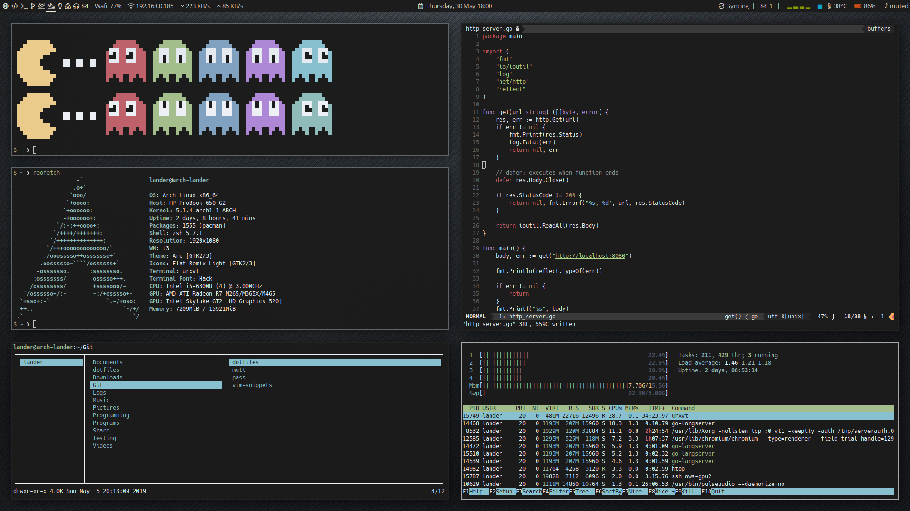

# Lander Moerkerke's dotfiles

## Requirements

-   Window manager: i3
-   Status bar: polybar
-   Hotkey daemon: sxhkd
-   Notifcation manager: dunst
-   Terminal: urxvt-unicode
-   Shell: zsh
-   Editor: nvim
-   Image viewer: sxiv
-   Browser: qutebrowser
-   File manager: lf
